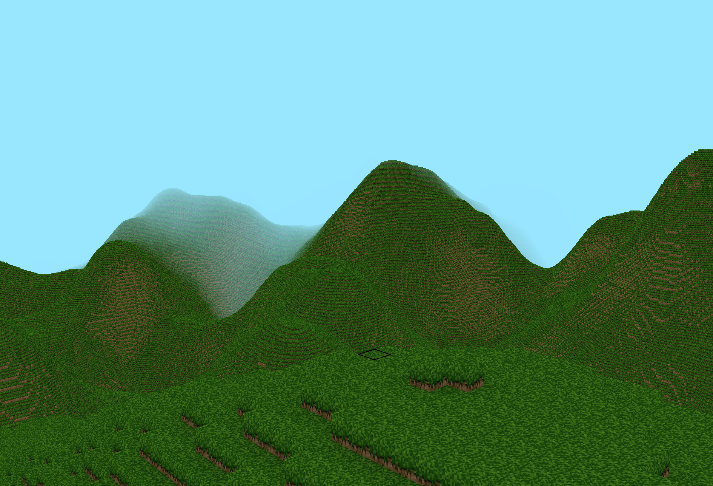
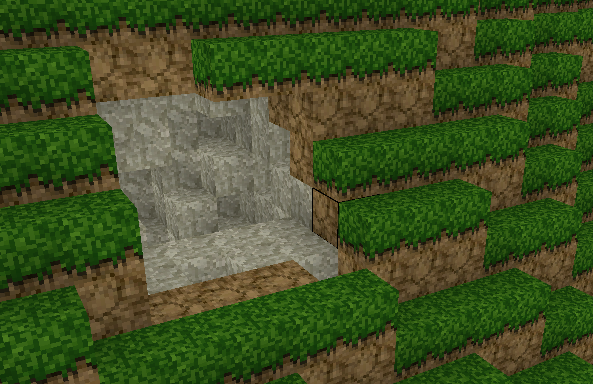
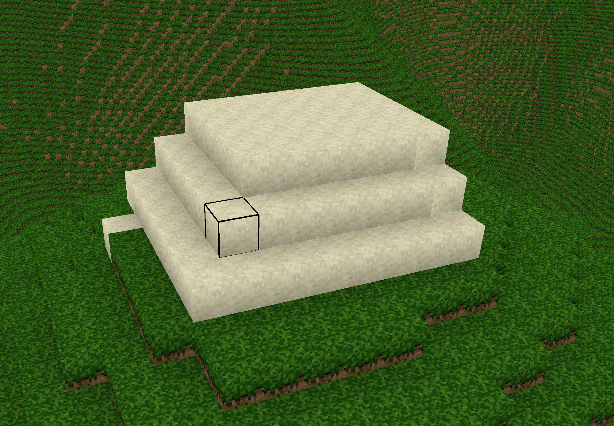

# SlimeCraft
A voxel engine written in C++ with OpenGL. You can fly around noise generated terrain, place blocks, and break blocks!

Here is a hillside I dug into:

Here are some blocks I placed:

## How It's Made:

**Tech used:** OpenGL, C++

At the core, this project generates voxel data based on noise generated with FastNoiseLite, and stored in a hashmap of 32x256x32 chunks, which are loaded and unloaded based on a render distance. 

## Optimizations

I learned a great deal about basic graphical optimizations while working on this project (and I continue to learn as I add more things). Here is a short list of what I currently have: 
- Back Face Culling
- Vertex Buffer Objects
- Multithreaded Chunk Generation
- Per-Voxel Ambient Occlusion

## Currently Working On:

- More diverse terrain
- Surface Features
- - Per-Voxel Lighting 

## Planned Features:

- LOD System
- Cave Generation
- Frustum Culling
- Saving and Loading Worlds

## Lessons Learned:

In coding this project, I learned a lot about the basics of OpenGL. I went into this project almost blindly, with my initial attempt using a 'block' object--I have since realized that taking over 8 seconds to generate a single chunk is generally frowned upon.
I've loved delving into the world of voxel engines and learning about the techniques used to generate millions of tiny cubes, as well as how to convince users that you are rendering much than what you really are.
The most important lesson I learned is that you can never be too optimized, and that there is always ways to improve. I hope to continue improving and optimizing this project as I learn!

